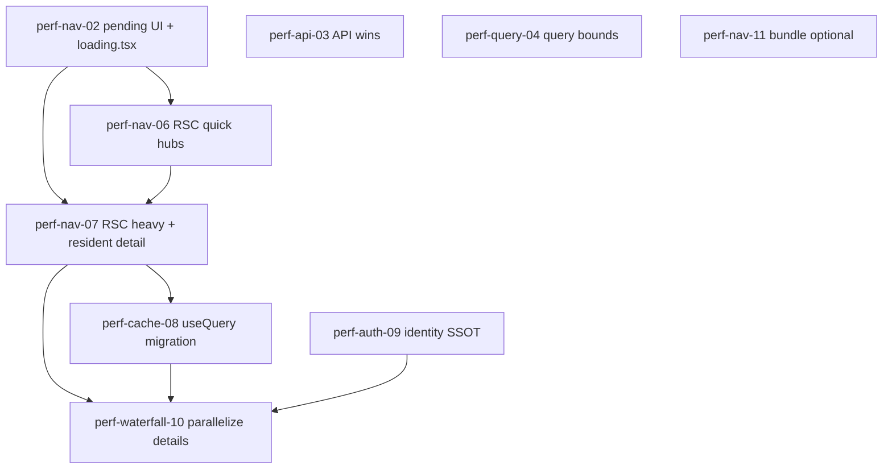

# Performance & Navigation Remediation — Initiative Handoff

**Date:** 2026-06-28  
**Status:** Ready for execution  
**Authoritative diagnosis:** [`2026-05-28-data-fetch-performance-audit.md`](./2026-05-28-data-fetch-performance-audit.md)  
**Prior failed mega-segment:** `perf-round-trip-reduction` (ESLint failure — do **not** repeat as one branch)

---

## Executive summary

Haven feels sluggish on every link click because **data loads after navigation**, not during it. The database is fast (prod: resident list ~3.5 ms, incidents ~0.4 ms). Perceived delay is **browser round-trip count × ~100–300 ms**, often 1–3 s on client-heavy pages, with **no instant click feedback** while the transition runs.

This initiative fixes **felt navigation speed** in 10 atomic segments. Phase 0 quick wins are partially shipped; the remaining work is **streaming shells + pending nav UI**, **RSC bootstrap for hot detail/hub routes**, **finish React Query migration**, and **collapse serial waterfalls**.

**Mission alignment:** `pass` — Reduces time-to-action on clinical and ops workflows without weakening RLS, auditability, or human-in-the-loop judgment.

**Do not:** Reset architecture, skip segment gates, or optimize DB indexes at current pilot scale (34 residents) — round-trip reduction dominates until tables exceed ~50k rows.

---

## What you're feeling (symptoms → mechanism)

| Symptom | Mechanism |
|---------|-----------|
| Click → nothing happens → then spinner | Client page mounts → `useEffect` fires → Supabase calls start **after** hydration |
| Same page slow on revisit | No `useQuery` / no RSC bootstrap → full refetch every mount |
| Sidebar click feels dead | No global `useLinkStatus` / progress bar; `loading.tsx` only covers RSC gap, not client fetch |
| Heavy pages worst (resident profile, admissions) | 5–17 serial or staged client round-trips (`resident-detail-overview-load.ts`, `admin/admissions/page.tsx`) |

**Architecture today (admin):**

```
Click Link
  → proxy.ts (session from cookies)          ✅ already optimized
  → AppShell (client, warm auth context)     ✅ HavenAuthProvider at (admin) layout
  → Route transition
  → page.tsx ("use client" on ~180 routes)
  → useEffect / manual fetch                 ❌ data starts here
  → Spinner → content
```

**Target architecture (hot routes):**

```
Click Link
  → proxy.ts
  → AppShell + NavPendingIndicator           🎯 perf-nav-02
  → loading.tsx skeleton in <main>           🎯 perf-nav-02
  → async page.tsx (RSC) fetches on server   🎯 perf-nav-06/07
  → thin client island + skipNextLoadRef     ✅ pattern exists
  → useQuery for refetch / facility change   🎯 perf-cache-08
```

---

## Already shipped (do not re-implement)

| Item | Evidence |
|------|----------|
| Proxy scoped to auth shells; `getSession()` not `getUser()` in middleware | `src/proxy.ts`, `src/lib/supabase/middleware.ts` |
| `HavenAuthProvider`: `getSession()` + joined `user_profiles` / `organizations` | `src/contexts/haven-auth-context.tsx` |
| `QueryClientProvider` (45s `staleTime`, no refetch on focus) | `src/components/layout/query-provider.tsx`, `(admin)/layout.tsx` |
| RSC bootstrap on hot **lists**: residents, incidents, staff, schedules, staffing, billing, executive, risk, compliance | See `src/app/(admin)/residents/page.tsx`, `incidents/page.tsx`, etc. |
| `skipNextLoadRef` client handoff | `AdminResidentsPageClient.tsx`, `AdminIncidentsPageClient.tsx` |
| ~19 pages on `useQuery` | `finance/journal-entries`, `vendors/*`, `insurance/*`, `certifications`, `training`, `reputation`, `time-records` |
| Group-level `loading.tsx` | `(admin)/loading.tsx`, `(caregiver)/loading.tsx`, `(family)/loading.tsx`, `admin/v2/loading.tsx` |

---

## Priority route matrix (P0 = fix first)

| Route | Pattern today | Client RTTs (est.) | Segment |
|-------|---------------|-------------------|---------|
| `/admin/residents/[id]` | client `useEffect` waterfall | 2–3 waves (~17 queries) | **perf-nav-07** |
| `/admin/admissions` | client 13+4 query waves | 2–3 | **perf-nav-07** |
| `/admin/referrals` | client 8+ parallel + HL7 | 2–3 | **perf-nav-07** |
| `/admin/incidents/[id]` | client ~1500-line waterfall | 10–14 serial | **perf-waterfall-10** |
| `/admin/rounding` | client 5-way `Promise.all` | 1 | **perf-nav-06** |
| `/admin/medications/errors` | client single-table | 1 | **perf-nav-06** |
| `/admin/care-plans/reviews-due` | client single loader | 1 | **perf-nav-06** |
| `/admin/dietary` | client 5-way parallel | 1 | **perf-nav-06** |
| `/admin/discharge` | client hub component | 1 | **perf-nav-06** |
| `/admin/billing/invoices` | client ledger `useEffect` | 1–2 | **perf-cache-08** |

**Already good (copy from, don't rewrite):** `/admin`, `/admin/residents`, `/admin/incidents`, `/admin/staff`, `/admin/schedules`, `/admin/billing` (overview).

---

## Segment plan (10 segments)

One bounded segment = one atomic commit. Gate artifact required before done.

### Phase 0 — Perceived speed (ship first)

#### perf-nav-02 — Global nav pending + segment loading shells

| | |
|---|---|
| **Scope** | Add instant click feedback; add `loading.tsx` under hot segments so `<main>` streams a skeleton during RSC transition |
| **Files** | New `src/components/layout/NavPendingIndicator.tsx` (or `useLinkStatus` wrapper in `AppShell.tsx`); copy `(admin)/loading.tsx` to `residents/`, `incidents/`, `admin/admissions/`, `billing/`, `staff/` |
| **Out of scope** | Data fetch changes, React Query |
| **Gates** | `npm run segment:gates -- --segment "perf-nav-02" --ui` |
| **Success** | Click sidebar → visible pending state &lt;100 ms; RSC routes show skeleton before paint |

#### perf-api-03 — API quick wins

| | |
|---|---|
| **Scope** | Drop `auth.users` full scan on admin users route; remove redundant `[facilityId]` facility re-fetch; memoize service-role client |
| **Files** | `src/app/api/admin/users/route.ts`, `src/app/api/admin/facilities/[facilityId]/*`, `src/lib/supabase/service-role.ts` |
| **Gates** | `npm run segment:gates -- --segment "perf-api-03"` |
| **Success** | Users list API: O(page size) not O(total users) |

#### perf-query-04 — Bound list queries

| | |
|---|---|
| **Scope** | Replace unbounded `select('*')` on insurance/vendor list pages with explicit columns + `.limit()` |
| **Files** | `insurance/claims`, `renewals`, `coi`, `loss-runs`, `vendors/contracts`, `vendors/spend` pages |
| **Gates** | `npm run segment:gates -- --segment "perf-query-04" --ui` |

---

### Phase 1 — Data arrives with navigation

#### perf-nav-06 — RSC bootstrap: single-wave hubs (quick wins)

| | |
|---|---|
| **Scope** | Server-fetch + `initial*` props for hubs with ≤5 parallel queries |
| **Routes** | `/admin/medications/errors`, `/admin/care-plans/reviews-due`, `/admin/assessments/overdue`, `/admin/rounding`, `/admin/discharge` |
| **Copy from** | `incidents/page.tsx` + `AdminIncidentsPageClient.tsx` (`skipNextLoadRef`) |
| **Gates** | `npm run segment:gates -- --segment "perf-nav-06" --ui` |

#### perf-nav-07 — RSC bootstrap: heavy hubs + resident detail

| | |
|---|---|
| **Scope** | Server loaders for admissions, referrals, **resident `[id]` overview** |
| **Files** | New `src/lib/admissions/admissions-hub-bootstrap.ts`, `src/lib/referrals/referrals-hub-bootstrap.ts`, `src/lib/residents/resident-detail-bootstrap.ts`; convert `residents/[id]/page.tsx` to async RSC |
| **Copy from** | `residents-roster-bootstrap.ts` (tier A loader pattern) |
| **Parallelize** | Collapse bed→room→unit chain in loader to nested PostgREST select or single `Promise.all` |
| **Gates** | `npm run segment:gates -- --segment "perf-nav-07" --ui` |
| **Success** | Resident detail: first paint includes header + clinical summary (no full-page spinner on cold nav) |

#### perf-cache-08 — Finish React Query migration (client hubs)

| | |
|---|---|
| **Scope** | Migrate remaining client-only hubs to `useQuery`; add `queryClient.invalidateQueries` on mutations |
| **Priority pages** | `billing/billing-invoice-ledger.tsx`, `admin/dietary/page.tsx`, `admin/facilities/page.tsx`, `transportation/page.tsx`, `admin/quality/page.tsx` |
| **Copy from** | `finance/journal-entries/page.tsx` (org-scoped), `reputation/page.tsx` (facility + `Promise.all` in `queryFn`) |
| **Gates** | `npm run segment:gates -- --segment "perf-cache-08" --ui` |
| **Success** | Back navigation within 45s = 0 new `rest/v1` calls on migrated pages |

---

### Phase 2 — Consolidation + worst waterfalls

#### perf-auth-09 — Identity single source of truth

| | |
|---|---|
| **Scope** | Remove remaining per-page `supabase.auth.getUser()`; delete or thin `load*RoleContext()` where `useHavenAuth()` suffices |
| **Still calling getUser** | ~20+ files — grep `getUser()` under `src/app/(admin)` and caregiver shells |
| **RSC pages** | Consider passing `organizationId` from server layout or JWT claims instead of `loadFinanceRoleContextServer()` duplicate query |
| **Gates** | `npm run segment:gates -- --segment "perf-auth-09"` |

#### perf-waterfall-10 — Parallelize detail pages

| | |
|---|---|
| **Scope** | `incidents/[id]/page.tsx`: extract loader, `Promise.all` independent queries; optional split to server loader + thin client |
| **Also** | Any remaining serial chains in `resident-detail-overview-load.ts` after perf-nav-07 |
| **Gates** | `npm run segment:gates -- --segment "perf-waterfall-10" --ui` |

#### perf-nav-11 — Optional bundle hygiene

| | |
|---|---|
| **Scope** | Dynamic-import `recharts` on chart pages; code-split `admissions/new` (2300 lines), `incidents/[id]` if still monolithic; delete dead `AdminShell.tsx` if still unreferenced |
| **Trigger** | Only if `ANALYZE=true npm run build && npm run homewood:perf-baseline` shows route &gt;450kb gzip |
| **Gates** | `npm run segment:gates -- --segment "perf-nav-11"` |

---

## Dependency graph



**Recommended execution order:**

1. **perf-nav-02** (biggest felt win for least risk — do this first)
2. **perf-nav-06** (5 quick RSC wins in one segment or split 2+2+1 if too large)
3. **perf-nav-07** (resident detail is the #1 drilldown — may need its own commit if scope explodes)
4. **perf-cache-08** (parallel with 06/07 if different engineer)
5. **perf-auth-09** → **perf-waterfall-10**
6. **perf-api-03**, **perf-query-04** anytime (orthogonal)
7. **perf-nav-11** only if bundle regression

---

## Copy-paste patterns (for implementers)

### RSC list bootstrap (gold standard)

```typescript
// src/app/(admin)/incidents/page.tsx
export default async function AdminIncidentsPage() {
  const cookieStore = await cookies();
  const initialFacilityId = parseSelectedFacilityCookieValue(
    cookieStore.get(SELECTED_FACILITY_COOKIE)?.value,
  );
  const supabase = await createClient();
  const initialRows = await fetchIncidentsFromSupabase(initialFacilityId, supabase);
  return (
    <AdminIncidentsPageClient
      initialRows={initialRows}
      initialFacilityId={initialFacilityId}
    />
  );
}
```

### Client skip-first-refetch

```typescript
// AdminIncidentsPageClient.tsx pattern
const skipNextLoadRef = useRef(
  initialRows !== undefined && selectedFacilityId === initialFacilityId,
);
// In fetch: if (skipNextLoadRef.current) { skipNextLoadRef.current = false; return; }
```

### useQuery hub template

```typescript
const { organizationId, loading: authLoading } = useHavenAuth();
const { data, isPending, error } = useQuery({
  queryKey: ["domain", "resource", organizationId, selectedFacilityId],
  enabled: !!organizationId,
  queryFn: async () => { /* supabase */ },
});
const loading = authLoading || isPending;
```

### Dedicated bootstrap loader (when logic is reusable)

See `src/lib/residents/residents-roster-bootstrap.ts` → consumed by `residents/page.tsx`.

---

## Success metrics

**Capture baseline before perf-nav-02** (commit JSON snippet in this doc or `docs/homewood/PERF_BASELINE.md`):

```bash
# Authenticated nav latency (Playwright)
BASE_URL=http://localhost:3000 RUNS=3 \
  ROUTES=/admin/residents,/admin/residents/<uuid>,/admin/incidents,/admin/admissions \
  node scripts/perf/admin-navigation-latency.mjs
```

| Metric | Baseline (audit) | Target (after perf-nav-07 + perf-nav-02) |
|--------|------------------|------------------------------------------|
| Repeat-nav cache hit (Back within 60s) | ~0% | ≥80% on migrated routes |
| Cold nav: client `rest/v1` count (resident detail) | ~17 staged | ≤3 waves; first paint with server data |
| Click → visible feedback | None | &lt;100 ms pending indicator |
| Admin nav p50 (script above) | _capture at start_ | ≥30% reduction |
| LCP p75 (Homewood P0) | &lt;2.5s target, manual pending | &lt;2.5s on `/admin/residents`, `/admin/incidents` |

**Re-measure after:** perf-nav-02 (feel), perf-nav-07 (data), perf-cache-08 (repeat visits).

---

## Verification checklist (every segment)

- [ ] `npm run segment:gates -- --segment "<id>"` → PASS JSON in `test-results/agent-gates/`
- [ ] Add `--ui` when routes/layouts/visual loading changed
- [ ] Mission alignment stated in segment handoff (`pass` | `risk` | `fail` + one sentence)
- [ ] Manual: click nav link → feedback immediate; data or skeleton within one frame budget
- [ ] DevTools Network: count `rest/v1` calls on cold vs repeat navigation

---

## Segment handoff template (fill per segment)

```markdown
# Segment handoff — perf-nav-02

## Summary
- **Segment id:** perf-nav-02
- **Mission alignment:** pass — Instant nav feedback improves staff clarity during shift workflows without changing auth or data boundaries.
- **Scope:** NavPendingIndicator + segment loading.tsx copies
- **Out of scope:** Data fetching, React Query

## Implementation notes
- Key decisions: …
- Follow-ups: migrate remaining segments per roadmap

## Verification
- Gate: test-results/agent-gates/<timestamp>-perf-nav-02.json
- Manual: sidebar click shows pending bar; /admin/residents shows skeleton during transition

## Commit
- `perf: add nav pending indicator and hot-route loading shells`
```

---

## Risks & waivers

| Risk | Mitigation |
|------|------------|
| Stale data shown from 45s cache | Document `staleTime`; use `invalidateQueries` on writes; facility change triggers refetch |
| RSC + client facility mismatch | Always pass `initialFacilityId` from `SELECTED_FACILITY_COOKIE`; keep `skipNextLoadRef` |
| Segment too large (perf-nav-07) | Split: `perf-nav-07a` resident detail, `perf-nav-07b` admissions/referrals |
| `perf-round-trip-reduction` repeat | Max ~5 routes per segment; run gates after each commit |

---

## First session BOOT checklist

1. Read this doc + `2026-05-28-data-fetch-performance-audit.md` Appendix A (DB is not the bottleneck).
2. Run baseline: `scripts/perf/admin-navigation-latency.mjs` with local `BASE_URL`.
3. Start **perf-nav-02** — no data-layer risk, immediate user-visible improvement.
4. Record baseline + segment results in `docs/Autonomous.md` (FIND / RECORD).
5. Do not merge multiple segments in one PR.

---

## Related files

| Purpose | Path |
|---------|------|
| Diagnosis (full) | `docs/reviews/2026-05-28-data-fetch-performance-audit.md` |
| Gate runbook | `docs/agent-gates-runbook.md` |
| Handoff template | `agents/templates/segment-handoff.md` |
| Primary nav (traffic proxy) | `src/lib/navigation/pillars.ts` |
| App shell | `src/components/layout/AppShell.tsx` |
| Nav latency script | `scripts/perf/admin-navigation-latency.mjs` |
| Homewood JS budget | `docs/homewood/PERF_BASELINE.md` |

---

## Segment completion: perf-nav-02 (2026-06-29)

**Status:** Implemented — gate artifact `test-results/agent-gates/2026-06-29T02-57-53-820Z-perf-nav-02.json`

| Check | Result |
|-------|--------|
| ESLint + constitution | PASS |
| Build | PASS |
| Design review (`--ui`) | PASS |
| Gitleaks / secrets | PASS |
| npm audit | FAIL (pre-existing hono/vite/ws — not introduced by this segment) |

### Shipped

- `src/components/layout/navigation-pending.tsx` — `NavigationPendingProvider`, `NavPendingIndicator`, `HavenNavLink` (transition-based pending)
- `src/components/layout/admin-route-loading.tsx` — shared route skeleton
- `src/components/layout/AppShell.tsx` — provider wrapper, pending bar in `<main>`, all shell nav uses `HavenNavLink` / `navigate()`
- `src/components/layout/HavenShellBrandLink.tsx` — uses `HavenNavLink`
- Segment `loading.tsx`: `residents/`, `incidents/`, `billing/`, `staff/`, `admin/admissions/`
- `@keyframes haven-nav-pending` in `globals.css`

### Manual verify

1. `npm run dev` → log in → click sidebar links (Residents, Incidents, Billing)
2. Expect: thin primary progress bar at top of main + slight opacity dip immediately on click
3. RSC routes (residents list, incidents list) should show skeleton in main during transition

### Next segment

**perf-auth-09** — identity SSOT (remove duplicate `getUser()` calls).

---

## Segment completion: perf-nav-06 (2026-06-29)

**Routes:** medications/errors, care-plans/reviews-due, assessments/overdue, rounding, discharge  
**Gate:** `test-results/agent-gates/2026-06-29T03-11-22-984Z-perf-nav-06.json` (segment checks PASS; verdict FAIL = pre-existing npm audit)

**New libs:** `load-medication-errors`, `load-rounding-overview`, `load-overdue-assessments`, `load-discharge-hub-bootstrap`; extended `fetchCarePlanReviewsDue` for server client.

---

## Segment completion: perf-nav-07 (2026-06-29)

**Routes:** residents/[id], admissions, referrals  
**Gate:** `test-results/agent-gates/2026-06-29T03-14-32-239Z-perf-nav-07.json` (segment checks PASS; verdict FAIL = pre-existing npm audit)

**Resident detail:** `loadResidentDetailBootstrap` + nested bed/room/unit PostgREST select (~5 fewer RTTs). First paint includes header on cold nav.

**New libs:** `resident-detail-bootstrap`, `admissions-hub-bootstrap`, `referrals-hub-bootstrap`

---

## Segment completion: perf-cache-08 (partial, 2026-06-29)

**Billing invoice ledger** migrated to `useQuery` with SSR `initialData` + `QueryClientLayout` wrapper.

---
