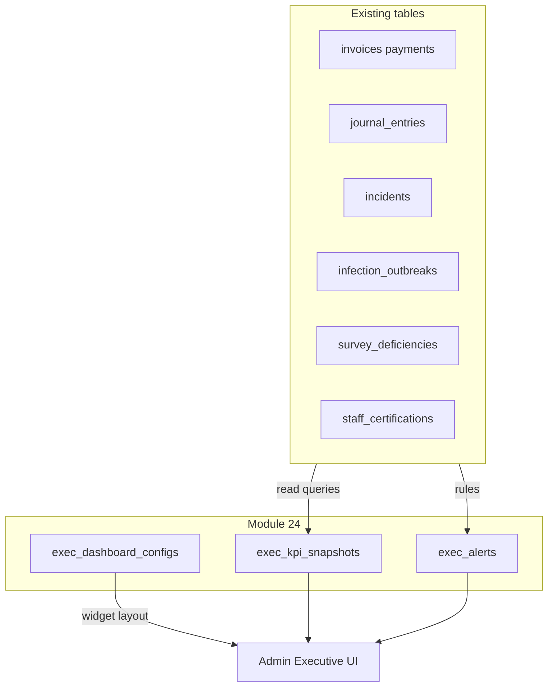

# 24 — Executive Intelligence Layer v1 (Phase 3)

**Dependencies:** Reads across **all shipped modules** — foundation, residents, daily ops, incidents, staff, billing, finance (17), compliance (08), infection (09), medication advanced (06), care planning advanced (03-adv). Optional aggregates from **18** and **19** when those tables exist.  
**Build weeks (target):** 27–28 (Core v1)  
**Migration sequence:** `046_*` (first migration for this module; follows `045_*` from Module 19)

---

## Implementation note (repo migrations vs spec SQL)

- Spec uses `auth.*` for readability; migrations use **`haven.*`** helpers per [README.md](README.md).
- This module is primarily a **read layer** over existing data — like `08-compliance-engine.md`. New tables store **configuration**, **cached snapshots**, and **alert queue** — not duplicates of clinical or financial source rows.

---

## Purpose and operator value

**Executive Intelligence v1** gives **owners and org admins** a single **organization command center**: KPI tiles, prioritized alerts, drill-down **organization → entity → facility**, and **saved report** definitions. It **does not** replace source modules; it **aggregates** and **links** into existing pages (`/admin/billing/*`, `/admin/compliance`, `/admin/incidents`, etc.).

**Operator outcomes (Core):**

- One screen for **portfolio health**: census, revenue, AR, incidents, infections, compliance backlog, staffing signals.
- **Alert feed** with acknowledge / resolve (stored in `exec_alerts`).
- **Historical comparison** via daily `exec_kpi_snapshots` (optional cron).
- **Per-user dashboard layout** via `exec_dashboard_configs`.

**Non-goals (Core v1):** Natural language querying; scenario modeling; AI-generated strategic narratives; regulatory horizon scanning — **Future / Phase 5** per roadmap.

---

## Scope tiers

### Core (v1)

- Tables: `exec_dashboard_configs`, `exec_kpi_snapshots`, `exec_alerts`, `exec_saved_reports`.
- **Computed KPIs** in application layer or SQL views/RPCs — no duplication of `invoices`, `incidents`, etc.
- RLS: `owner`, `org_admin` full access to config/snapshots/alerts/reports; `facility_admin` **read-only** scoped to accessible facilities (snapshots and alerts filtered by `facility_id` when set).
- Admin UI: routes in § Admin UI.

### Enhanced (same phase if time allows)

- **Strategic report templates:** ops weekly, financial monthly, board quarterly — PDF/CSV export from `exec_saved_reports` + snapshot queries.
- Period-over-period **delta** badges on KPI tiles.

### Future (Phase 5+)

- Natural language queries with audit log of generated SQL / API calls.
- Scenario models (rate change, occupancy shock, acquisition).
- AI “insights” stream with human dismiss/acknowledge.

---

## Design principle



**No** ETL that copies resident PHI into new wide tables. **Optional** `metrics jsonb` in snapshots holds **aggregates only** (counts, sums in cents, rates).

---

## KPI domains (computed — not new columns elsewhere)

| Domain | Example metrics | Primary sources |
|--------|-----------------|-----------------|
| Census / occupancy | Licensed beds, occupied beds, occupancy %, ADC | `beds`, `residents`, `census_daily_log` |
| Financial | Revenue MTD/YTD (cash from `payments`), AR buckets, revenue/bed, budget variance | `invoices`, `payments`, `journal_entries`, `journal_entry_lines`, `gl_budget_lines` |
| Clinical / safety | Open incidents MTD, falls count, med errors MTD | `incidents`, `medication_errors` |
| Infection | Active surveillance rows, active outbreaks | `infection_surveillance`, `infection_outbreaks` |
| Compliance | Open deficiencies, overdue POC tasks, policy ack rate | `survey_deficiencies`, `plans_of_correction`, `policy_acknowledgments` |
| Workforce | Cert expiring 30d, staffing ratio snapshot | `staff_certifications`, `staffing_ratio_snapshots`, `time_records` |
| Insurance (optional) | Active claims, upcoming renewals | `insurance_claims`, `insurance_policies`, `insurance_renewals` (Module 18) |
| Vendors (optional) | Open PO value, overdue vendor invoices | `purchase_orders`, `vendor_invoices` (Module 19) |

**Implementation:** `src/lib/exec-kpi-snapshot.ts` (or equivalent) builds a typed `ExecKpiPayload` from parameterized queries; `exec_kpi_snapshots.metrics` stores JSON matching a versioned schema (document in code).

---

## Alert prioritization (Core algorithm — illustrative)

Assign each alert a numeric **score** = `severity_weight * recency_factor * impact_weight`:

| Severity | Weight |
|----------|--------|
| critical | 100 |
| warning | 50 |
| info | 10 |

**Recency:** higher if `created_at` within 24h. **Impact:** rule table in code (e.g. staffing ratio breach > open deficiency > cert expiring).

Surface **“Top 3 today”** = highest scores where `resolved_at` is null, limited to user’s scope.

---

## DATABASE SCHEMA

```sql
-- ============================================================
-- ENUMS
-- ============================================================
CREATE TYPE exec_alert_severity AS ENUM ('critical', 'warning', 'info');

CREATE TYPE exec_alert_source_module AS ENUM (
  'billing',
  'finance',
  'incidents',
  'infection',
  'compliance',
  'staff',
  'medications',
  'insurance',
  'vendors',
  'system'
);

CREATE TYPE exec_snapshot_scope AS ENUM ('organization', 'entity', 'facility');

CREATE TYPE exec_report_template AS ENUM (
  'ops_weekly',
  'financial_monthly',
  'board_quarterly',
  'custom'
);

-- ============================================================
-- DASHBOARD CONFIG (per user)
-- ============================================================
CREATE TABLE exec_dashboard_configs (
  id uuid PRIMARY KEY DEFAULT gen_random_uuid (),
  organization_id uuid NOT NULL REFERENCES organizations (id),
  user_id uuid NOT NULL REFERENCES auth.users (id),

  widgets jsonb NOT NULL DEFAULT '[]'::jsonb,
  default_date_range text NOT NULL DEFAULT 'mtd'
    CHECK (default_date_range IN ('mtd', 'qtd', 'ytd', 'last_30', 'last_90')),

  created_at timestamptz NOT NULL DEFAULT now (),
  updated_at timestamptz NOT NULL DEFAULT now (),
  deleted_at timestamptz
);

CREATE UNIQUE INDEX idx_exec_dashboard_configs_user ON exec_dashboard_configs (organization_id, user_id)
WHERE
  deleted_at IS NULL;

-- ============================================================
-- KPI SNAPSHOTS (materialized aggregates)
-- ============================================================
CREATE TABLE exec_kpi_snapshots (
  id uuid PRIMARY KEY DEFAULT gen_random_uuid (),
  organization_id uuid NOT NULL REFERENCES organizations (id),

  scope_type exec_snapshot_scope NOT NULL,
  scope_id uuid NOT NULL,

  snapshot_date date NOT NULL,
  metrics_version integer NOT NULL DEFAULT 1,
  metrics jsonb NOT NULL DEFAULT '{}'::jsonb,

  computed_at timestamptz NOT NULL DEFAULT now (),
  computed_by text DEFAULT 'cron',

  deleted_at timestamptz
);

CREATE INDEX idx_exec_kpi_snapshots_lookup ON exec_kpi_snapshots (organization_id, scope_type, scope_id, snapshot_date DESC)
WHERE
  deleted_at IS NULL;

-- ============================================================
-- ALERTS
-- ============================================================
CREATE TABLE exec_alerts (
  id uuid PRIMARY KEY DEFAULT gen_random_uuid (),
  organization_id uuid NOT NULL REFERENCES organizations (id),

  source_module exec_alert_source_module NOT NULL,
  severity exec_alert_severity NOT NULL,

  title text NOT NULL,
  body text,

  entity_id uuid REFERENCES entities (id),
  facility_id uuid REFERENCES facilities (id),

  deep_link_path text,

  score numeric(12, 4),

  acknowledged_at timestamptz,
  acknowledged_by uuid REFERENCES auth.users (id),
  resolved_at timestamptz,
  resolved_by uuid REFERENCES auth.users (id),

  created_at timestamptz NOT NULL DEFAULT now (),
  updated_at timestamptz NOT NULL DEFAULT now (),
  deleted_at timestamptz
);

CREATE INDEX idx_exec_alerts_open ON exec_alerts (organization_id, severity, created_at DESC)
WHERE
  deleted_at IS NULL
  AND resolved_at IS NULL;

CREATE INDEX idx_exec_alerts_facility ON exec_alerts (facility_id)
WHERE
  deleted_at IS NULL;

-- ============================================================
-- SAVED REPORTS
-- ============================================================
CREATE TABLE exec_saved_reports (
  id uuid PRIMARY KEY DEFAULT gen_random_uuid (),
  organization_id uuid NOT NULL REFERENCES organizations (id),
  created_by uuid NOT NULL REFERENCES auth.users (id),

  name text NOT NULL,
  template exec_report_template NOT NULL DEFAULT 'custom',
  parameters jsonb NOT NULL DEFAULT '{}'::jsonb,

  last_generated_at timestamptz,
  last_output_storage_path text,

  created_at timestamptz NOT NULL DEFAULT now (),
  updated_at timestamptz NOT NULL DEFAULT now (),
  deleted_at timestamptz
);

CREATE INDEX idx_exec_saved_reports_org ON exec_saved_reports (organization_id)
WHERE
  deleted_at IS NULL;
```

---

## RLS POLICIES (policy intent)

| Role | exec_dashboard_configs | exec_kpi_snapshots | exec_alerts | exec_saved_reports |
|------|-------------------------|-------------------|-------------|-------------------|
| `owner`, `org_admin` | CRUD own row (user_id = uid) | SELECT all in org; optional INSERT from service role for cron | SELECT/UPDATE (ack/resolve) all in org | Full CRUD |
| `facility_admin` | CRUD own row | SELECT rows where `scope_type = 'facility'` AND `scope_id` in accessible facilities; SELECT org-level snapshots optional (read-only aggregate — product choice: **Core** = facility-scoped only for facility_admin) | SELECT/UPDATE where `facility_id` in accessible or null | No access (Core) |
| Others | No access | No access | No access | No access |

**Recommended Core:** `facility_admin` sees **alerts** and **snapshots** only for their facilities; org-wide KPI tiles hidden or aggregated with label “Your facilities.”

---

## Audit and updated_at

- `exec_dashboard_configs`, `exec_kpi_snapshots`, `exec_alerts`, `exec_saved_reports`: `haven_set_updated_at` where updates allowed; `haven_capture_audit_log` on insert/update/delete for config, alerts, saved reports. Snapshots inserted by cron may use service role with audit metadata in `computed_by`.

---

## Admin UI (routes)

| Route | Purpose |
|-------|---------|
| `/admin/executive` | Organization command center: KPI grid, Top 3 alerts, entity cards |
| `/admin/executive/entity/[id]` | Entity: facilities list with KPI strip per facility |
| `/admin/executive/facility/[id]` | Facility deep-dive: all domains + links to source modules |
| `/admin/executive/alerts` | Full alert inbox; filters; bulk acknowledge |
| `/admin/executive/reports` | Saved reports; generate CSV/PDF |
| `/admin/executive/settings` | Dashboard widget layout (writes `exec_dashboard_configs`) |

**Mirrored routes:** Re-export under `/executive/*` per [FRONTEND-CONTRACT.md](FRONTEND-CONTRACT.md) pattern if used elsewhere.

---

## Edge Functions (optional)

| Function | Trigger | Logic |
|----------|---------|-------|
| `exec-daily-kpi-snapshot` | Cron 06:00 UTC | Insert `exec_kpi_snapshots` for org, each entity, each facility |
| `exec-alert-evaluator` | Cron hourly | Evaluate rules; insert/update `exec_alerts` |

---

## Acceptance criteria (Core v1)

1. Migration `046_*` creates enums and four tables, indexes, RLS, triggers.
2. **owner** / **org_admin** see full org command center; **facility_admin** sees scoped snapshots/alerts per policy above.
3. At least **five KPI families** wired from real queries (census, financial, incidents, compliance, workforce) — placeholders not allowed in production UAT.
4. Drill-down links navigate to existing module routes with query params where helpful.
5. `npm run migrations:check` and `npm run migrations:verify:pg` pass.
6. Segment gate with `--ui` passes for `/admin/executive/*`.

---

## Spec summary (for handoff)

**Executive Intelligence v1** adds **configuration**, **KPI snapshots**, **prioritized alerts**, and **saved reports** — **aggregating** existing Haven data for **owner visibility** without duplicating PHI. **NLQ, scenarios, and AI insights** are **out of scope** for Core v1 (Phase 5).
