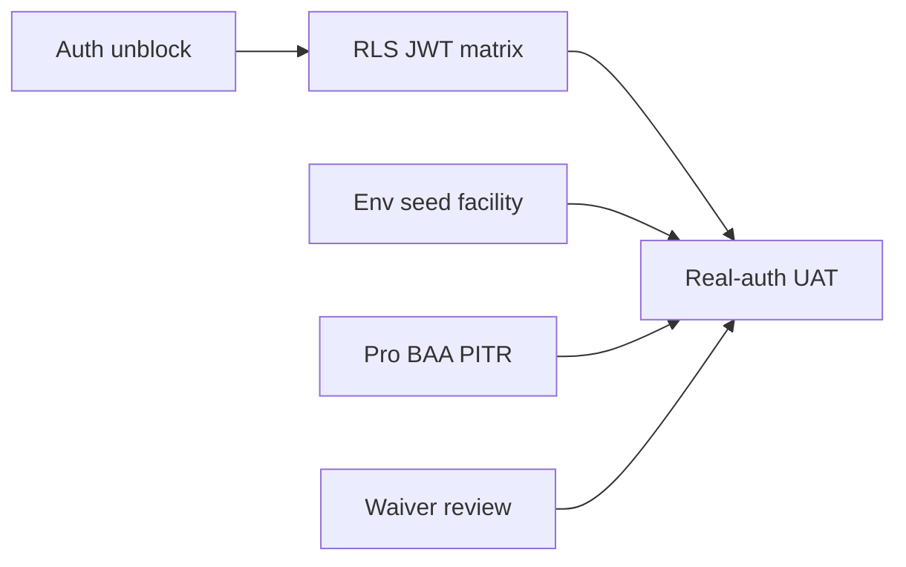

# Track A — Phase 1 acceptance closeout (single roadmap)

**Purpose:** One place to **finish** Track A without hunting across a dozen files. This is the execution order and evidence map. Authoritative verdicts still live in [PHASE1-CLOSURE-RECORD.md](./PHASE1-CLOSURE-RECORD.md).

**Last updated:** 2026-04-09

---

## Why Track A has felt “stuck”

Track A is **not** only engineering work. It requires:

| Who | What |
|-----|------|
| **Supabase / project owner** | **A1 (2026-04-09):** Pilot JWT issuance and §A shell routing are **owner-verified** after hosted Auth fix + repo migrations **`110`–`111`** (`app_metadata.app_role`, `user_profiles.updated_by`). If Auth regresses, use [PHASE1-AUTH-DEBUG-HANDOFF.md](./PHASE1-AUTH-DEBUG-HANDOFF.md). |
| **Owner or delegated tester** | **A2–A3:** Live **RLS** matrix, **§B–§E UAT**, **Pro / BAA / PITR** attestation. Agents cannot sign your BAA or tick dashboard boxes. |
| **Repo / agent** | Scripts, docs, migration parity checks, and recording **PASS/FAIL** in the execution logs once you paste evidence. |

**Closing Track A** means: every row in the table below has a **done** condition and a **named artifact** (file path, screenshot reference, or gate JSON).

---

## Definition of done (Track A closed)

Track A is **closed** when **all** are true:

1. [PHASE1-CLOSURE-RECORD.md](./PHASE1-CLOSURE-RECORD.md) — **Overall Phase 1 full acceptance** can be set to **PASS** or **PASS WITH WAIVERS** (per that file’s rules).
2. [PHASE1-EXECUTION-LOG.md](./PHASE1-EXECUTION-LOG.md) — applicable checklist rows **PASS** or **WAIVED** with owner approval.
3. [PHASE1-RLS-VALIDATION-RECORD.md](./PHASE1-RLS-VALIDATION-RECORD.md) — overall verdict **PASS** (or explicitly scoped deferrals documented).
4. [PHASE1-ENV-CONFIRMATION.md](./PHASE1-ENV-CONFIRMATION.md) — target project, migrations, and owner confirmations are current.
5. [PHASE1-WAIVER-LOG.md](./PHASE1-WAIVER-LOG.md) — active waivers reviewed and still acceptable.

**A1** and **A2** are cleared for the single-facility pilot (2026-04-09). **A3** (depth UAT) and **A5** remain open until recorded.

---

## Execution map (do in order)

- **A4** can run in parallel with **A1** (env host, seeds).
- **A5** is dashboard-only; do before PHI on production.
- **A6** should complete before calling Phase 1 “fully accepted” with waivers.

---

## A1 — Auth unblock on target project

| Field | Content |
|-------|---------|
| **Blocks** | ~~A2, A3~~ — was blocked until JWTs; **cleared 2026-04-09** for pilot users |
| **Owner** | Project owner + Supabase (dashboard/support as needed) |
| **Canonical handoff** | [PHASE1-AUTH-DEBUG-HANDOFF.md](./PHASE1-AUTH-DEBUG-HANDOFF.md) — **resolved** for current target; retain for regression |
| **Repo proof commands** | `npm run demo:auth-check` → expect `pilot_login_ok: true`; migrations **`110`–`111`** on target |
| **Done when** | **MET (2026-04-09)** — Pilot users sign in; [PHASE1-EXECUTION-LOG.md](./PHASE1-EXECUTION-LOG.md) **PH1-A01** **PASS** |

**If Auth returns `Database error querying schema` again:** treat as regression; stop depth UAT until restored.

---

## A2 — RLS JWT matrix on target project

| Field | Content |
|-------|---------|
| **Prerequisite** | A1 complete — **met 2026-04-09** |
| **Procedure** | [PHASE1-RLS-MANUAL-PROCEDURE.md](./PHASE1-RLS-MANUAL-PROCEDURE.md) |
| **Record results in** | [PHASE1-RLS-VALIDATION-RECORD.md](./PHASE1-RLS-VALIDATION-RECORD.md) |
| **Done when** | **MET (2026-04-09)** — [PHASE1-RLS-VALIDATION-RECORD.md](./PHASE1-RLS-VALIDATION-RECORD.md) **PASS** (owner sign-off; **RLS-02** N/A until second facility) |

---

## A3 — Real-auth pilot UAT

| Field | Content |
|-------|---------|
| **Prerequisite** | A1; A2 as applicable for your risk tolerance (RLS often run before calling acceptance “complete”) |
| **Checklist** | [PHASE1-ACCEPTANCE-CHECKLIST.md](./PHASE1-ACCEPTANCE-CHECKLIST.md) |
| **Record in** | [PHASE1-EXECUTION-LOG.md](./PHASE1-EXECUTION-LOG.md) |
| **Done when** | Sections **A–E** (and **F** as applicable) show **PASS** or **WAIVED** with evidence |

**Optional local automation (does not replace A3):** with app running, `BASE_URL=… npm run demo:auth-smoke` covers **PH1-A02** / **PH1-A03** only.

---

## A4 — Environment, seed, facility context

| Field | Content |
|-------|---------|
| **Owner** | Owner / ops |
| **Record in** | [PHASE1-ENV-CONFIRMATION.md](./PHASE1-ENV-CONFIRMATION.md), execution log preconditions |
| **Includes** | `.env.local` host = canonical project; `supabase migration list` aligned; seeded users + `user_profiles` / `user_facility_access` / family links as needed; facility selector behavior for pilot |
| **Done when** | PH1-P01–P04 (and related rows) satisfied per execution log |

**Repo helpers:** [DEMO-SEED-RUNBOOK.md](./DEMO-SEED-RUNBOOK.md), `npm run demo:ops-status` for migration + function snapshot.

---

## A5 — Pro plan, BAA before PHI, PITR

| Field | Content |
|-------|---------|
| **Owner** | Owner / legal / billing |
| **Where** | Supabase dashboard + contracts |
| **Record in** | [PHASE1-ENV-CONFIRMATION.md](./PHASE1-ENV-CONFIRMATION.md) and/or closure record |
| **Done when** | PH1-P06 (and closure criteria) owner-attested |

---

## A6 — Active waiver review

| Field | Content |
|-------|---------|
| **Source** | [PHASE1-WAIVER-LOG.md](./PHASE1-WAIVER-LOG.md) |
| **Done when** | Each open waiver still has owner acceptance, expiry if needed, and remediation path; or closed in repo |

---

## One-page checklist (copy progress)

| Step | Artifact to update | Owner | Status |
|------|-------------------|-------|--------|
| A1 | Auth handoff + `demo:auth-check` + execution log PH1-A01 | Owner + Supabase | **Done (2026-04-09)** |
| A2 | `PHASE1-RLS-VALIDATION-RECORD.md` | Tester | **Done (2026-04-09)** — owner sign-off |
| A3 | `PHASE1-EXECUTION-LOG.md` | Tester | ☐ |
| A4 | `PHASE1-ENV-CONFIRMATION.md` + PH1-P03–P04 | Owner | ☐ |
| A5 | Dashboard attestation in env/closure | Owner | ☐ |
| A6 | `PHASE1-WAIVER-LOG.md` review | Owner | ☐ |
| **Final** | `PHASE1-CLOSURE-RECORD.md` — set overall acceptance | Owner | ☐ |

**Progress (2026-04-09):** **A1** + **A2** owner-verified: pilot JWTs, shells, and **RLS matrix** ([PHASE1-EXECUTION-LOG.md](./PHASE1-EXECUTION-LOG.md), [PHASE1-RLS-VALIDATION-RECORD.md](./PHASE1-RLS-VALIDATION-RECORD.md)). **Next:** **A3** §B–§E UAT + **PH1-A04**, **A4** env/facility as needed, **A5** Pro/BAA/PITR, **A6** waivers.

**Progress (2026-04-21, S0 closeout):** Track A reconciled with current repo state (**193 migrations**, **27 Edge Function folders**) and all 5 COL facilities now confirmed via insurance policy NSC101045. RLS-02's single-facility deferral no longer applies — multi-facility seed (migration `120`) has shipped. Remaining blockers crystallized in [S0-CLOSEOUT-MEMO.md](./S0-CLOSEOUT-MEMO.md): **A3** depth UAT, **A5** Pro/BAA/PITR, RLS-02 re-execute. A6 waiver review current (no new waivers). Finding: **pre-existing lint debt** — 60 `no-explicit-any` errors across 56 files, not from S0 scope; flagged for cleanup before S1 meaningful TypeScript lands.

---

## Quick commands (reference)

| Goal | Command |
|------|---------|
| Target auth probe | `npm run demo:auth-check` |
| Migration + functions + auth summary | `npm run demo:ops-status` |
| Local shell + login smoke (app must be running) | `BASE_URL=http://127.0.0.1:3001 npm run demo:web-health` then `… demo:auth-smoke` |
| Authenticated role smoke (after A1 fix) | `BASE_URL=http://127.0.0.1:3001 npm run demo:auth-smoke:real` |
| All local checks bundled | `BASE_URL=http://127.0.0.1:3001 npm run demo:pilot-readiness` — optional **`PILOT_READINESS_AUTH_SMOKE_REAL=1`** appends Playwright **`demo:auth-smoke:real`** (four pilot roles; PH1-A04 / PH1-P04) |
| Full ops sequence | [PHASE1-OPS-VERIFICATION-RUNBOOK.md](./PHASE1-OPS-VERIFICATION-RUNBOOK.md) |
| Gate proof after repo changes | `npm run segment:gates -- --segment "<id>"` (+ `--ui` when UI/routes change) |

---

## Mission alignment

Track A closes when **secure, role-governed access** and **live validation evidence** match the mission in [docs/mission-statement.md](../mission-statement.md). **A1** clears the prior auth blocker; full acceptance remains **risk** until **A2** and depth **A3** close per [PHASE1-CLOSURE-RECORD.md](./PHASE1-CLOSURE-RECORD.md).

---

## Related specs

- [README.md](./README.md) — Completion remediation tracks
- [PHASE1-CLOSURE-RECORD.md](./PHASE1-CLOSURE-RECORD.md) — authoritative verdict
- [PHASE1-ACCEPTANCE-CHECKLIST.md](./PHASE1-ACCEPTANCE-CHECKLIST.md) — UAT rows
- [PHASE1-AUTH-DEBUG-HANDOFF.md](./PHASE1-AUTH-DEBUG-HANDOFF.md) — Auth escalation
